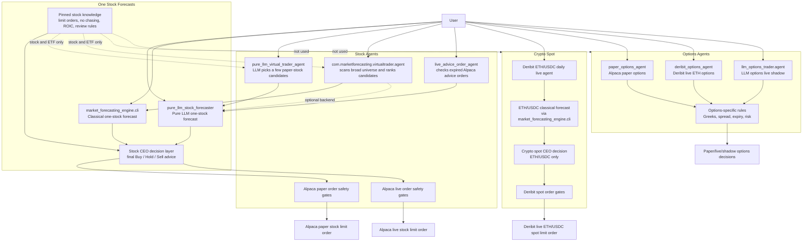

# Trading Agents Overview

This file lists the main agents and forecast commands discussed so far.

## Flow Diagram



## Quick Choice

| Need | Use |
| --- | --- |
| Ask in plain language and route to the right tool | `market_forecasting_engine.trading_router_agent` |
| One stock, pure LLM forecast | `market_forecasting_engine.pure_llm_stock_forecaster` |
| One stock, classical forecast | `market_forecasting_engine.cli` |
| Paper stock agent that scans many tickers | `com.marketforecasting.virtualtrader.agent` |
| Paper stock agent that lets LLM pick a few tickers | `market_forecasting_engine.pure_llm_virtual_trader_agent` |
| Live Alpaca stock order checker for expired advice orders | `market_forecasting_engine.live_trading.stocks.advice_order_agent` |
| Live Deribit ETH/USDC spot agent | `market_forecasting_engine.live_trading.deribit_eth_usdc_daily_agent` |
| Alpaca paper options agent | `market_forecasting_engine.paper_options_agent` |
| Deribit live ETH options agent | `market_forecasting_engine.deribit_options_agent` |
| LLM options live-shadow simulator | `market_forecasting_engine.llm_options_trader.agent` |

## Stock Agents And Forecasts

### `market_forecasting_engine.trading_router_agent`

Router for plain-language trading requests.

What it does:
- Reads a user question.
- Chooses the likely local agent/tool.
- Builds safe command options.
- Asks for missing details when needed.
- Defaults to advice-only or dry-run.
- Blocks live orders unless explicitly requested and confirmed.

Use when:
- You want Codex to decide which existing agent to use.
- You do not want to remember each agent's options.

Important behavior:
- Ambiguous stock advice asks: pure LLM or classical forecast.
- Options requests ask for risk size if missing.
- Expired Alpaca order checks stay dry-run by default.
- Universe stock scans run once and dry-run by default.
- Existing agents still run independently as before.

Example:

```bash
PYTHONPATH=automated_forecasting_engine/src ./venv/bin/python -m market_forecasting_engine.trading_router_agent "give me advice for AAPL and MSFT"
```

### `market_forecasting_engine.pure_llm_stock_forecaster`

Standalone one-stock pure LLM forecast.

What it does:
- Builds LLM evidence for one ticker.
- Runs a pure LLM forecast.
- Reads market structure and liquidity.
- Uses stock strategy knowledge.
- Calls the CEO decision layer.

Use when:
- You want one ticker explained mostly by LLM reasoning.
- You want CEO advice for one stock without running the broad scanner.

Important options:
- `--ticker`: stock ticker.
- `--company`: company name, optional but useful.
- `--provider`: price provider, often `yahoo` or `alpaca`.
- `--interval`: price interval, for example `1d`.
- `--bars`: recent bars to include.
- `--llm-provider`: model provider for forecast evidence.
- `--ceo-llm-provider`: model provider for CEO advice.
- `--ceo-llm-model`: CEO model.
- `--trader-profile`: `conservative`, `medium`, or `aggressive`.
- `--holding-status`: `owned` or `not_owned`.
- `--portfolio-notes`: extra account or position context.

CEO layer:
- Yes.

Orders:
- No direct order submission by this standalone command.

### `market_forecasting_engine.cli`

Standalone one-stock classical forecast.

What it does:
- Runs the normal model forecast pipeline.
- Uses validation and technical report sections.
- Adds long-term source evidence.
- Uses strategy knowledge.
- Calls the CEO decision layer by default.

Use when:
- You want the normal full forecast for one stock.
- You want model and validation evidence, not only LLM reasoning.

Important options:
- `--ticker`: stock ticker.
- `--provider`: price provider.
- `--start`: start date.
- `--interval`: price interval.
- `--horizons`: forecast horizons.
- `--trader-profile`: CEO profile.
- `--llm-provider`: CEO model provider.
- `--llm-model`: CEO model.
- `--llm-env-file`: env file with API keys.
- `--disable-autonomous-llm-decision`: forecast only, no CEO decision.
- `--disable-strategy-knowledge`: skip strategy knowledge.

CEO layer:
- Yes by default.

Orders:
- No direct order submission by this standalone command.

### `com.marketforecasting.virtualtrader.agent`

Main Alpaca paper stock agent.

What it does:
- Checks paper account state.
- Plans the next cycle.
- Can scan a broad stock universe.
- Ranks candidate tickers.
- Runs forecast and CEO decision.
- Applies paper-order safety gates.
- Can submit Alpaca paper stock limit orders.

Use when:
- You want the agent to look across many tickers and choose candidates.
- You want a more structured stock paper-trading workflow.

Important options:
- `--max-universe-tickers`: how many tickers the scout can inspect.
- `--scout-final-candidates`: shortlist size from the scout.
- `--max-managed-candidates`: max candidates sent to forecast.
- `--horizons`: forecast horizons.
- `--risk-profile`: risk setting.
- `--trader-profile`: CEO profile.
- `--forecast-backend`: `full` or `pure_llm`.
- `--dry-run`: do not submit paper orders.
- `--allow-market-closed-orders`: allow orders when market is closed.
- `--allow-repeated-symbol-orders`: allow repeated orders for same symbol.

CEO layer:
- Yes.

Orders:
- Alpaca paper stock orders only.
- Uses safety gates before order submission.

### `market_forecasting_engine.pure_llm_virtual_trader_agent`

Isolated Alpaca paper stock agent.

What it does:
- Checks synced Alpaca paper account state.
- Uses LLM market intelligence.
- Uses LLM planner.
- Uses LLM scout to pick a few stock tickers.
- Builds LLM evidence and fundamentals.
- Runs pure LLM forecast and CEO advice.
- Builds paper order plans.
- May submit Alpaca paper stock limit orders.

Use when:
- You want a smaller LLM-first paper stock agent.
- You want the LLM to choose only a few tickers.

Important options:
- `--env-file`: Alpaca paper env file.
- `--max-candidates`: max stock candidates.
- `--planner-provider`: provider for planning.
- `--llm-provider`: provider for forecast/evidence steps.
- `--ceo-llm-provider`: provider for CEO advice.
- `--ceo-llm-model`: CEO model.
- `--risk-profile`: risk setting.
- `--trader-profile`: CEO profile.
- `--dry-run`: do not submit paper orders.
- `--compact-llm-handoffs`: compact evidence between LLM steps.

CEO layer:
- Yes.

Orders:
- Alpaca paper stock orders only.
- Limit-order guidance is included in stock CEO knowledge.

### `market_forecasting_engine.live_trading.stocks.advice_order_agent`

Live Alpaca stock advice-order checker.

What it does:
- Reads Alpaca live account state.
- Checks open orders.
- Checks recently expired watched orders.
- If needed, reruns pure LLM stock forecast and CEO advice.
- Builds a replacement limit-order plan.
- Can submit a live Alpaca stock limit order if explicit live flags are present.

Use when:
- You already had a live stock advice limit order.
- That order expired.
- You want the agent to re-check the thesis before replacing it.

Important options:
- `--tickers`: watched stock tickers.
- `--only-if-expired`: forecast only when a watched order expired.
- `--force-forecast`: force forecast now.
- `--expired-lookback-hours`: how far back to look for expired orders.
- `--execute-live-orders`: allow live submission.
- `--confirm-live-order-risk`: required confirmation for live submission.
- `--max-notional-per-order`: cap order size.
- `--order-prefix`: client order id prefix.

CEO layer:
- Yes, through `pure_llm_stock_forecaster`.

Orders:
- Alpaca live stock limit orders.
- Dry-run by default.

## Crypto Spot

### `market_forecasting_engine.live_trading.deribit_eth_usdc_daily_agent`

Live Deribit ETH/USDC spot agent.

What it does:
- Runs one daily ETH/USDC forecast and CEO decision.
- Caches the CEO decision.
- Checks live price hourly.
- May submit Deribit live spot limit orders.
- Reconciles existing active orders and managed inventory.

Use when:
- You want the dedicated ETH/USDC live spot workflow.

Important options:
- `--instrument`: usually `ETH_USDC`.
- `--ticker`: usually `ETH-USDC`.
- `--forecast-provider`: usually `deribit`.
- `--forecast-interval`: forecast bar interval.
- `--forecast-horizons`: forecast horizons.
- `--daily-forecast-local-time`: daily refresh time.
- `--max-notional-usdc`: max order notional.
- `--max-base-position`: max managed ETH position.
- `--execute-live-orders`: allow live orders.
- `--confirm-live-deribit-eth-usdc-orders`: required live confirmation.

CEO layer:
- Yes, but this is crypto spot. Do not use stock-only investing guidance here.

Orders:
- Deribit live spot limit orders.
- Dry-run unless live flags are present.

## Options Agents

### `market_forecasting_engine.paper_options_agent`

Alpaca paper options agent.

What it does:
- Runs fast forecasts for one underlying.
- Selects option contracts.
- Applies Greeks, spread, expiry, risk, and position gates.
- Can submit Alpaca paper options orders.
- Manages exits with profit/loss and expiry rules.

Use when:
- You want options paper trading for one ticker such as TSLA.

Important options:
- `--ticker`: underlying stock.
- `--forecast-hours`: short forecast horizons.
- `--min-dte`, `--max-dte`: expiry range.
- `--max-total-debit`: max premium debit.
- `--risk-budget-pct`: account risk budget.
- `--max-contracts`: max contracts.
- `--require-greeks`: require Greeks.
- `--entry-order-policy`: usually `limit`.
- `--exit-order-policy`: exit behavior.
- `--execute-paper-orders`: allow paper order submission.

CEO layer:
- No.

Orders:
- Alpaca paper options orders.

### `market_forecasting_engine.deribit_options_agent`

Deribit live ETH options agent.

What it does:
- Runs forecast and option-entry logic for ETH options.
- Applies Deribit option constraints.
- Applies spread, Greeks, risk, expiry, and feedback gates.
- Can submit Deribit live options orders.

Use when:
- You want live ETH options trading on Deribit.

Important options:
- `--account-mode live`: live mode.
- `--currency`: usually `ETH`.
- `--instrument-currency`: usually `USDC`.
- `--forecast-hours`: short forecast horizons.
- `--min-dte`, `--max-dte`: expiry range.
- `--max-total-debit-usd`: max premium debit.
- `--risk-budget-pct`: account risk budget.
- `--max-contracts`: max contracts.
- `--entry-order-policy`: usually `limit`.
- `--execute-live-orders`: allow live orders.
- `--confirm-live-deribit-options-orders`: required live confirmation.

CEO layer:
- No.

Orders:
- Deribit live options orders.

### `market_forecasting_engine.llm_options_trader.agent`

LLM options live-shadow agent.

What it does:
- Reads live market/options context.
- Uses LLM entry, exit, and profit-policy prompts.
- Simulates decisions in shadow mode.
- Tracks shadow positions, orders, memory, and PnL.

Use when:
- You want to test an LLM options decision loop without real submission.

Important options:
- `--account-mode live`: use live market/account context.
- `--simulation-only`: shadow simulation.
- `--currency`: usually `ETH`.
- `--instrument-currency`: usually `USDC`.
- `--llm-provider`: provider for LLM decisions.
- `--llm-model`: model.
- `--strategy-mode`: strategy profile.
- `--trader-profile`: LLM trader profile.
- `--output-dir`: state directory.

CEO layer:
- No stock CEO. It uses options-specific LLM prompts.

Orders:
- Shadow/simulated by default when `--simulation-only` is used.

## Stock Guidance Now Included

For stock and ETF CEO paths, the pinned stock guidance includes:
- Prefer limit orders.
- Do not chase huge daily jumps.
- Do not buy hard drops caused by bad business news.
- Do not average down only because price is cheaper.
- Growth side: one buy per week as guidance.
- ETF accumulation: one buy per month as guidance.
- Review growth positions after about 7% to 8% drawdown.
- Reduce or sell if business news gets materially worse.
- Consider partial profit after a strong rise when momentum weakens.
- Check ROIC / return on invested capital when available.

This guidance applies to stock and ETF CEO decisions only.
It does not apply to options or crypto agents.
